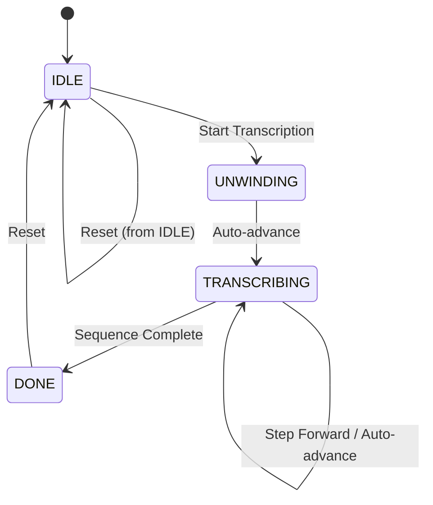

# 🧬 Molecular Biology Playground

> Interactive simulation of DNA transcription to mRNA — built with React, TypeScript, and HTML5 Canvas.

[](https://molecular-playground-efcj.vercel.app/)


---

## 🎯 Why I Built This

As a former biology teacher with a background in biochemistry, I saw students struggle with abstract molecular processes like DNA transcription. This project transforms passive textbook diagrams into an **interactive, visual experience** — bridging my deep domain expertise with modern frontend development.

🎯 **Career Objective:** Seeking opportunities to build impactful software at the intersection of EdTech, BioTech, and Web Development, with a strong focus on the Nordic tech market.

---

## ✨ Features

- 🧬 **Real-time Transcription:** Instant DNA → mRNA conversion.
- 🎬 **Canvas Animation:** Step-by-step visualization of RNA Polymerase movement.
- 🧮 **Codon Visualization:** 3-letter groups with distinct color coding.
- 📊 **Dynamic Analytics:** Live bar chart showing nucleotide composition.
- ⚡ **Playback Controls:** Play / Pause / Step Forward / Reset with adjustable speed (0.5x / 1x / 2x).
- ✅ **Robust Validation:** Strict DNA input validation with bilingual (EN/FA) error handling.
- 🌙 **Modern UI:** Dark-themed molecular laboratory interface, fully responsive.

---

## 🛠 Tech Stack

| Category | Technology | Why This Choice |
|----------|------------|-----------------|
| **Framework** | React 19 | Component-based architecture, industry standard. |
| **Language** | TypeScript | Type safety, better DX, standard in Nordic companies. |
| **State Mgmt** | Zustand | Lightweight, zero boilerplate, perfect for mid-size apps. |
| **Animation** | HTML5 Canvas API | High performance for real-time rendering without heavy libs. |
| **Styling** | Tailwind CSS v4 | Utility-first, rapid prototyping, highly popular in startups. |
| **Build Tool** | Vite | Lightning-fast HMR and modern bundling. |

---

## 🏗 Architecture & Design

### Directory Structure
```text
molecular-playground/
├── src/
│   ├── utils/
│   │   └── transcription.ts       # Pure bioinformatics functions (Testable)
│   ├── store/
│   │   └── useSimulationStore.ts  # Centralized state machine (Zustand)
│   ├── components/
│   │   ├── Header.tsx             # App title with gradient styling
│   │   ├── DNASequenceInput.tsx   # DNA input with regex validation
│   │   ├── AnimationCanvas.tsx    # Canvas-based molecular animation
│   │   ├── ControlPanel.tsx       # Play/Pause/Step/Reset controls
│   │   ├── SequenceOutput.tsx     # mRNA display with codon colors
│   │   └── NucleotideChart.tsx    # Dynamic bar chart of base percentages
│   ├── App.tsx                    # Root component + animation loop
│   ├── main.tsx                   # Entry point
│   └── index.css                  # Tailwind imports
├── public/                        # Static assets
├── package.json
├── tsconfig.json
├── vite.config.ts
└── README.md
```

### Animation State Machine
The core of the application relies on a strict Finite State Machine (FSM) to prevent invalid UI states.


*Each state transition is handled by Zustand actions, ensuring the animation never enters an invalid state.*

### Key Design Decisions

| Decision | Implementation | Benefit |
|----------|----------------|---------|
| **Separation of Concerns** | Pure logic in `/utils`, state in `/store`, UI in `/components` | Highly testable, maintainable, and scalable. |
| **Pure Functions** | `transcribeDNA()`, `validateDNA()` | Deterministic, testable without a browser environment. |
| **Canvas over SVG** | Molecular animation uses Canvas API | Superior performance for real-time animation of multiple objects. |

---

## 🧪 Key Technical Highlights

### 1. Pure Bioinformatics Functions
```typescript
// No React dependency — pure, deterministic, and easily testable
export function transcribeDNA(dna: string): string {
  const complement: Record<string, string> = { A: 'U', T: 'A', C: 'G', G: 'C' }
  return dna.toUpperCase().split('').map(b => complement[b] || '?').join('')
}
```

### 2. Type-Safe Nucleotide Handling
```typescript
type RNANucleotide = 'A' | 'U' | 'C' | 'G' // Only valid mRNA bases
type AnimationStep = 'IDLE' | 'UNWINDING' | 'TRANSCRIBING' | 'DONE' // Finite state

// TypeScript catches invalid nucleotide assignments at compile time!
```

### 3. Robust Animation Loop with Cleanup
```typescript
// In App.tsx — runs the animation engine safely
useEffect(() => {
  if (!isPlaying) return
  const interval = setInterval(() => advanceAnimation(), speed)
  
  // Crucial: Prevents memory leaks when component unmounts or speed changes
  return () => clearInterval(interval) 
}, [isPlaying, speed, advanceAnimation])
```

---

## 🚀 Getting Started

### Prerequisites
- Node.js 18.0 or higher
- npm, yarn, or pnpm

### Installation
```bash
# Clone the repository
git clone https://github.com/ehsan1992-71/molecular-playground.git
cd molecular-playground

# Install dependencies
npm install

# Start development server
npm run dev
```
Open [http://localhost:5173](http://localhost:5173) in your browser.

### Build for Production
```bash
npm run build
npm run preview
```

---

## 📖 How to Use

| Step | Action | What Happens |
|------|--------|--------------|
| 1 | Enter a DNA sequence | Only A, T, C, G allowed (max 30 nucleotides). |
| 2 | Click **Start** | RNA Polymerase begins transcribing DNA to mRNA. |
| 3 | Use **Step** | Advance one nucleotide at a time for detailed observation. |
| 4 | Adjust Speed | Choose 0.5x, 1x, or 2x playback speed. |
| 5 | Click **Reset** | Clear everything and return to the initial state. |

**Example Sequences to Try:**
- `ATGCGTACC` — 9 nucleotides (default)
- `AAAATTTTCCCCGGGG` — Equal distribution of all 4 bases
- `ATGCCGATTACGTAA` — Longer sequence with varied composition

---

## 📊 What I Learned

| Skill | How This Project Demonstrates It |
|-------|----------------------------------|
| **React + TypeScript** | Full type-safe component architecture and state management. |
| **Canvas API** | Programmatic 2D drawing, coordinate systems, and animation frames. |
| **State Machines** | Modeling complex biological processes as predictable finite states. |
| **Pure Functions** | Writing testable, deterministic business logic separated from UI. |
| **Domain-Driven Design** | Applying deep biochemistry knowledge to software architecture. |

---

## 🔮 Future Improvements

- [x] Deploy to Vercel for live demo link.
- [ ] Add Translation step (mRNA → Protein) with a codon table lookup.
- [ ] Implement a CRISPR-Cas9 gene editing simulation module.
- [ ] Replace `setInterval` with `requestAnimationFrame` for smoother 60fps animation.
- [ ] Add comprehensive accessibility features (ARIA labels, full keyboard navigation).
- [ ] Implement internationalization (i18n) for seamless Persian/English toggling.

---

## 📝 License

This project is licensed under the MIT License — see the [LICENSE](LICENSE) file for details.

---

## 👤 About Me

Former biology teacher with a university degree in Biochemistry, now transitioning into professional software development. I build tools at the intersection of **biology, education, and technology**.

🔍 **Looking for:** Junior/Mid Frontend Developer or Bioinformatics Software Developer roles, particularly in Scandinavia (Sweden, Norway, Denmark, Finland) or remote opportunities.

💡 **What makes me different:** I don't just write code — I understand the scientific domain deeply and can translate complex biological concepts into intuitive, performant software.

*Built with ❤️ for students who learn better by seeing.*
